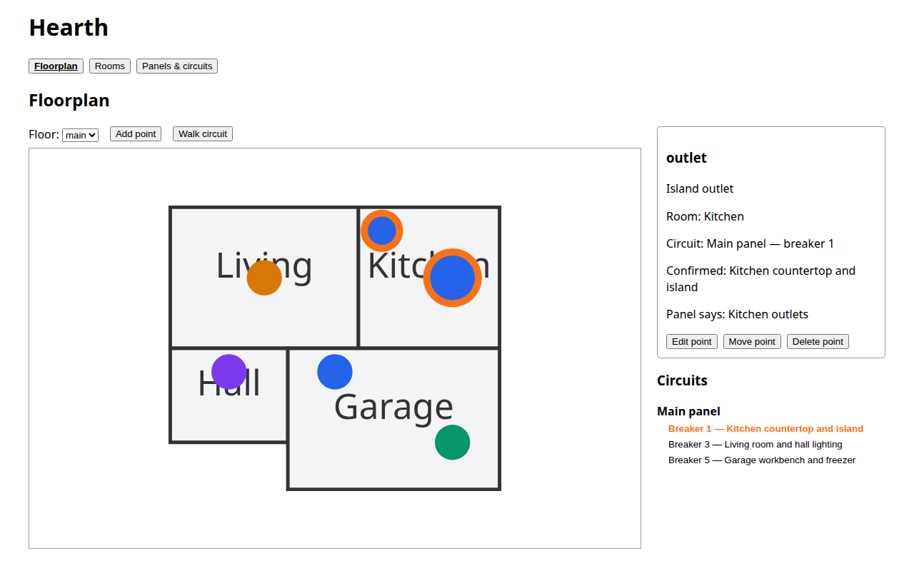
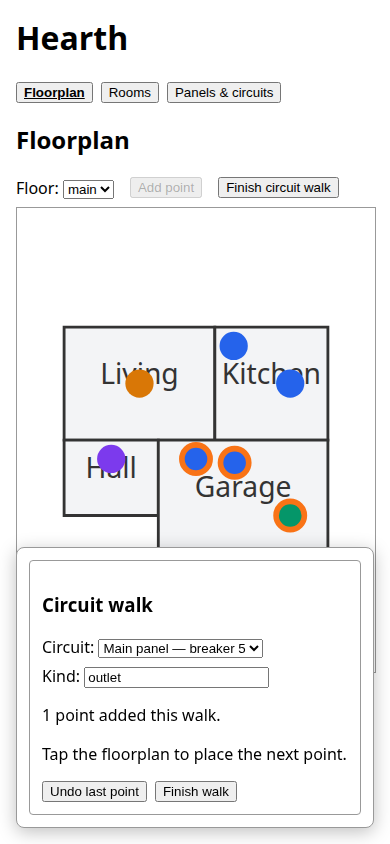

# hearth

Self-hosted home information tracker. Phase 1: rooms, electrical panels/circuits,
and an interactive floorplan where clicking an outlet/fixture shows its breaker
(and clicking a breaker highlights its points on the floorplan). Maintenance
scheduling and vendor/quote tracking are planned for later phases — the schema
is shaped to add them without a rework.

## Screenshots

Desktop floorplan with a selected point and its circuit details:



Circuit-walk capture at phone width:



See [ARCHITECTURE.md](ARCHITECTURE.md) for how it's put together and why.

## Layout

- `backend/` — FastAPI + SQLAlchemy + Alembic, SQLite storage
- `frontend/` — React + Vite + TypeScript SPA
- `scripts/import_drawio.py` — one-off importer that turns room shapes drawn in
  an existing `.drawio` floorplan into the JSON the `rooms` API expects
- `Dockerfile` / `compose.yaml` / `compose.dev.yaml` — single-container build
  (frontend built and served alongside the API)

## Dev setup

Backend (needs [uv](https://docs.astral.sh/uv/)):

```
cd backend
mkdir -p data
uv sync --frozen --extra dev
uv run alembic upgrade head
uv run uvicorn hearth.main:app --reload --port 8000
```

Frontend, in another terminal:

```
cd frontend
npm ci
npm run dev
```

Open http://localhost:5173 — the Vite dev server proxies `/api` to the
backend on :8000.

Backend tests: `cd backend && uv run pytest`. Frontend tests: `cd frontend &&
npm run test` for unit tests or `npm run test:e2e` for the Chromium browser
regressions. Install the browser once with `npx playwright install chromium`.
The browser suite uses synthetic API fixtures and does not need a Hearth
database. Lint: `uv run ruff check .` (backend), `npm run lint` (frontend).

## Importing an existing drawio floorplan

```
python3 scripts/import_drawio.py path/to/house.drawio --post-to http://localhost:8000
```

Each room shape (a labeled rectangle) becomes a room; each `<diagram>` page in
the file becomes a floor, named after the page's tab name unless `--floor` is
given. Drop `--post-to` to just print the JSON instead of creating rooms
directly.

## Docker

```
docker compose -f compose.yaml -f compose.dev.yaml up --build
```

Builds the frontend, bakes it into the image alongside the API, runs Alembic
migrations on container start, and serves both from one port (default 8000).
`compose.yaml` alone (no `-f compose.dev.yaml`) pulls the published
`ghcr.io/r055le/hearth:main` image instead of building locally — that's what
the deploy host runs.

The container runs as the distroless `nonroot` user (uid/gid `65532`) with a
read-only rootfs, so before the *first* `up`, create and chown the bind-mounted
data directory to match: `mkdir -p data && sudo chown 65532:65532 data`.
Skipping this crash-loops the container on
"unable to open database file".

No auth in this phase — intended for tailnet/home-network access only, same
trust model as other self-hosted services here. See `deploy/README.md` for
the GHCR publish + host deploy pipeline.
